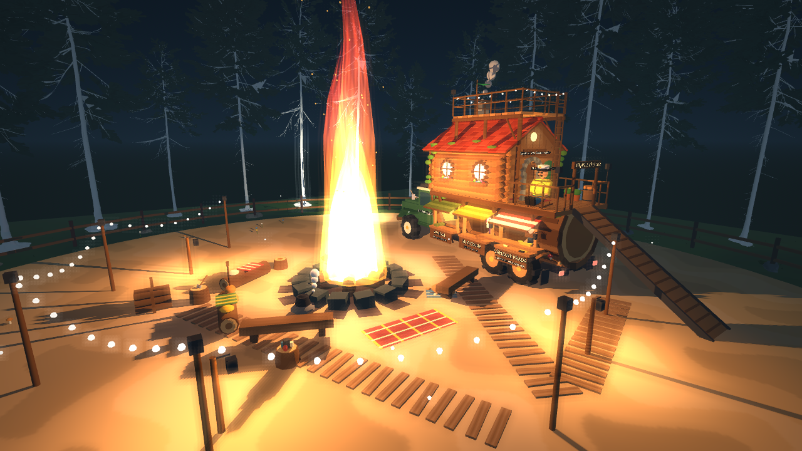

# Stejarul Călător — camionul-bază

„Stejarul Călător” („The Wandering Oak”) e baza vânătorilor și singurul lor vehicul. E un cap de camion verde care trage un stejar bătrân, culcat și scobit. Prin geamurile cioplite în trunchi se văd cele trei magazine. Din trunchi crește o căsuță din bușteni, cu acoperiș de țiglă cărămizie, iar înăuntru sunt depozitul personal și atelierul de blănuri. Sus, deasupra acoperișului, e o terasă de pe care se trage în timp ce altcineva conduce. Tabăra a rămas doar focul, cozy, cu camionul parcat alături.

Totul e procedural, low-poly și toon, ca restul jocului. Nu folosește asset-uri externe noi.

## Cum se joacă

- **Volanul:** E la ușa cabinei (stânga-față). În tabără, când hostul se urcă la volan, se deschide direct harta expedițiilor. **Tab** o redeschide oricând de la volan. În expediție, aceeași hartă oferă „Înapoi în tabără”. Focul încă deschide harta, ca alternativă.
- **Terasa:** E la scara de frânghie (dreapta-spate) sau la scara de pe verandă. Hunterul ocupă un post de trăgător (3 posturi). Acolo își păstrează camera, ținta, ochirea și reîncărcarea și trage în timp ce un prieten conduce. Șoferul nu trage. E coboară hunterul lângă camion, doar dacă vehiculul e aproape oprit.
- **Magazinele, la geamurile din stânga trunchiului:**
  - Arsenal — Gică Pistolică;
  - Ghiozdane — Tanti Rucsandra;
  - Vânzare pradă — Nea Fane.

  Magazinele funcționează oriunde e camionul, inclusiv în expediție. Portbagajul (trapa din dreapta) e mereu „parcat la vânzător”.
- **Căsuța:** Cu camionul parcat, rampa coboară din spate. Urci pe verandă, unde Nea Nelu se leagănă în balansoar, și intri pe ușa rotundă. Înăuntru e Debaraua lui Moș Debara (depozit personal) și mașina de curățat blănuri. Mașina merge acum și în expediție.
- **Plecarea:** Când șoferul pornește, cine e încă pe verandă sau în căsuță urcă automat pe un post de pe terasă. Dacă posturile sunt pline, coboară lângă camion. O curățare de blană în curs se anulează și blana crudă revine în ghiozdan.
- **Călătoria:** Cine e la volan sau pe terasă când începe încărcarea hărții ajunge tot acolo, în camion, la destinație (și la întoarcere).

## Structură (coordonate locale)

Fața camionului e spre −Z, +X e dreapta, y=0 e solul sub roți.

| Parte | Unde | Ce conține |
| --- | --- | --- |
| Cabină | z −6,9…−2,9 | Cabină verde cu crem, grilă cromată, faruri rotunde (spoturi reale), bară de protecție din buștean, coarne de cerb pe capotă, portbagaj de acoperiș cu felinar și lemne, coș cromat cu fum, numele pe uși |
| Remorca-trunchi | z −2,6…6,0, rază 1,62 | 14 doage de scoarță cu inele la capete, mușchi, ciuperci, o creangă înfrunzită. Pe stânga: trei geamuri cu rame cioplite, copertine de șindrilă în culorile magazinului, tejghele și numele pe șorț. Înăuntru: lemn de miez, pereți despărțitori, felinare și marfa la vedere (arme OBUR, ghiozdane, blănuri, cântar) |
| Căsuța | podea la 3,65 m | Pereți din bușteni rotunzi cu colțuri încrucișate, ramuri care cresc din trunchi și susțin podeaua, ferestre rotunde luminate cu jardiniere de flori, ușă rotundă verde deschisă, arc de piatră, firmă |
| Acoperiș | streașină 6,0 m, coamă 7,45 m | Țiglă cărămizie rând cu rând, mușchi, coș de piatră cu fum, frontoane din scânduri cu fereastră rotundă de pod |
| Terasa | podea la 7,8 m | Punte de scânduri cu balustradă din crengi, ghirlandă de becuri, două felinare, fanion, trei rogojini care marchează posturile, scara de pe verandă |
| Veranda | z 3,1…6,0 | Balansoarul lui Nea Nelu, butoi, ghivece, felinare, poartă cu numele camionului, rampă rabatabilă (scoasă din parcare, intră sub remorcă) |

Geometria statică e comasată pe culori în aproximativ 70 de mesh-uri (`world/camp/toon_builder.gd`). Mesh-urile au meta `styled`, deci `GameArt.dress_scene` nu le repictează. Roțile (4 fizice, cele din spate desenate ca tandem), rampa, fumul și NPC-urile sunt noduri separate.

## Fizică și rețea

- `HuntingJeep` (numele clasei a rămas pentru compatibilitate) e un `RigidBody3D` pe host. Folosește aceeași suspensie raycast cu cerc de frecare ca jeep-ul, reglată pentru un camion de 3,6 t:
  - arcuri de 125 kN/m, roți de 0,78 m;
  - ampatament de 8,9 m și bracaj de 0,62 rad la viteză mică;
  - 19 m/s înainte și 6 m/s înapoi;
  - centru de masă jos, amortizare de ruliu și forțe laterale aplicate la înălțimea osiei, ca să nu se încline căsuța.
- **Parcarea:** Fără șofer, după 0,8 s de repaus, camionul se îngheață pe host (`parked`, replicat în snapshot). Rampa coboară și coliziunea ei devine activă, așa că pe verandă se poate merge ca pe sol static. Un șofer care urcă îl dezgheață și strânge rampa.
- **Locurile:** Locul 0 e volanul, locurile 1–3 sunt posturile de pe terasă. Pozițiile se recalculează pe fiecare peer din camionul local (pe client e o replică interpolată), deci trăgătorii nu alunecă de pe terasă.
- **Validarea hostului:** `_shoot` acceptă trăgătorii (loc > 0) și refuză șoferul. `reload` și schimbarea armei merg de pe post. `start_hunt` e acceptat de la volan sau lângă foc. `enter` primește valoarea `"terrace"` ca să prefere un post. Magazinele, depozitul și mașina de curățat trec în continuare prin `_at_stall`, cu distanță 3D; razele geamurilor sunt de 2 m, ca să nu atingi magazinul vecin.
- **Coliziunea cu vânătorii:** Camionul nu se ciocnește de vânători (mask 1|16), dar vânătorii se ciocnesc de camion. Un hunter cinematic teleportat de pe terasă la sol ar fi fost tratat de Jolt ca o lovitură uriașă.
- Nu există RPC-uri noi. NPC-urile, fumul și animațiile taberei sunt locale.

## NPC-uri

| NPC | Unde | Replici |
| --- | --- | --- |
| Gică Pistolică | geamul Arsenal | 8, prima e „Hai să cumperi de aici în rasa ta!” |
| Tanti Rucsandra | geamul Ghiozdane | 7 |
| Nea Fane Blănaru | geamul Vânzare | 7 |
| Moș Debara | tejgheaua din căsuță | 6 |
| Nea Nelu | balansoarul de pe verandă | 6, noi: șoferul pensionar care vă lasă pe voi la volan |

Când te apropii la 6,5 m, NPC-ul se întoarce spre tine. Doar unul vorbește odată, iar balonul (cu fundal închis) iese pe geam, deasupra copertinei. Replicile sunt în `data/localization/{ro,en}.json` (`NPC_<ID>_<n>`).

## Tabăra

`world/camp/cozy_camp.gd` adaugă în jurul focului decorul cozy:
- doi bușteni cu pături în carouri și trei buturugi;
- ceainic pe o piatră, cu abur;
- căni și felinar pe o buturugă;
- covor;
- chitară;
- stivă de lemne și butuc cu topor;
- ghirlande de becuri pe stâlpi;
- trei felinare cu lumină caldă;
- 26 de licurici;
- hamac;
- ciuperci și flori;
- un câine care doarme pe o pătură și dă din coadă.

Corturile, lada și tarabele de pânză au fost scoase din `camp.tscn`.

## Verificare

- `tests/verify_base.gd` (suita `base` din `run_headless_tests.ps1`), 66 de verificări:
  - tabăra cozy și poziția camionului;
  - ghișeele de pe camion, cu fața spre foc;
  - NPC-urile, atelierul montat și batch-urile toon;
  - parcarea și rampa: un hunter real urcă rampa prin mișcarea hostului și ajunge în căsuță;
  - posturile de pe terasă;
  - magazinele, depozitul privat și vânzarea;
  - harta deschisă de la volan și startul de la volan;
  - călătoria cu șofer și trăgător la bord;
  - tragerea din mers (șoferul nu poate trage);
  - urcarea automată la plecare și anularea curățării;
  - harta „Înapoi în tabără”;
  - cheile RO/EN.
- `tests/network_peer.gd`: în faza de condus, client2 trage de pe terasă prin ENet cât timp client1 conduce, iar hostul confirmă focul. Faza `storage` folosește tejgheaua din căsuță.
- `tests/preview_base.gd [director]` face capturi cu: tabăra, fața, geamurile, vânzarea, căsuța, atelierul, terasa, vederea trăgătorului din mers și camionul pe drumul din pădure.

## Limite

- Pe terasă, trăgătorii stau la posturi fixe (3), nu se plimbă în mers. Pe camionul parcat se merge liber pe rampă, verandă și în căsuță.
- Remorca e rigidă față de cabină (un singur corp fizic), ca să se conducă stabil. Nu e o articulație reală de semiremorcă.
- Interiorul căsuței e mic, iar camera third person se apropie de vânător.
- Magazinele funcționează și în expediție, pentru că baza merge cu voi. Bucla „vinde în tabără” devine opțională.
