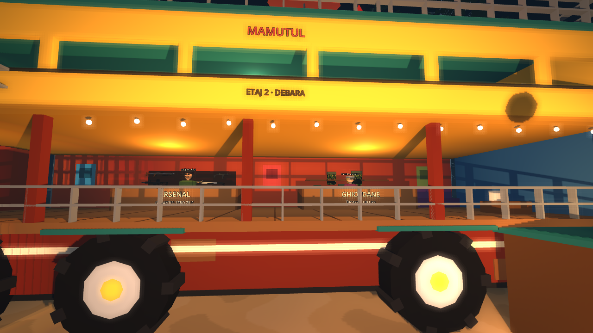
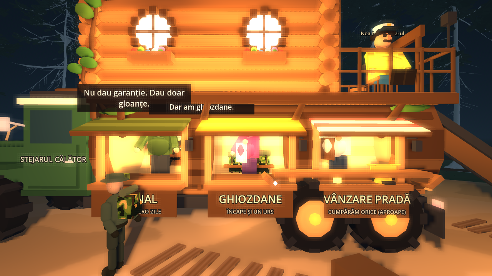
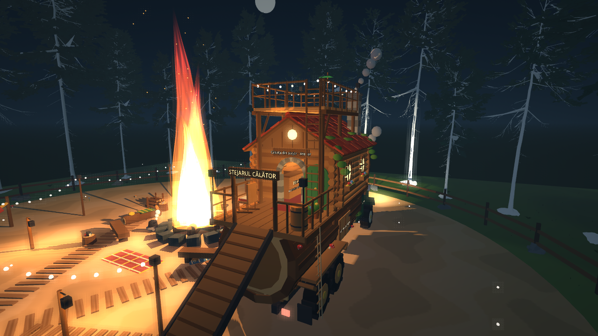
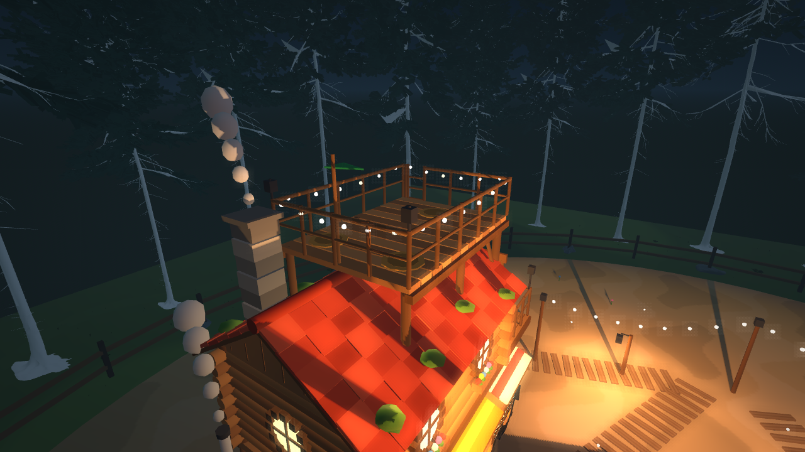
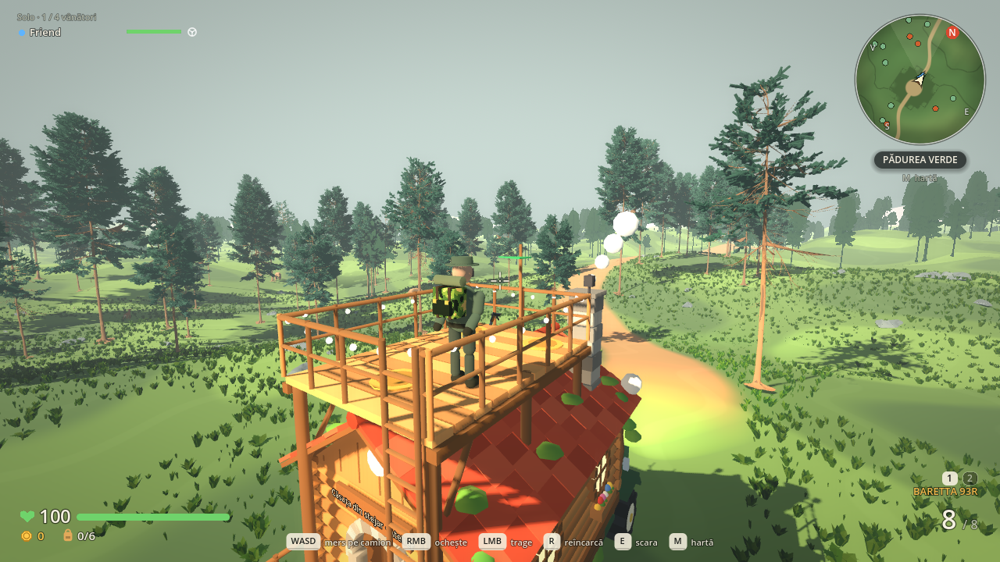
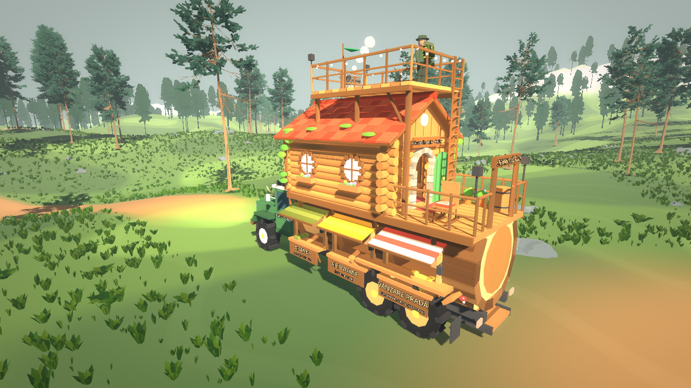

# Stejarul Călător — camionul-bază

„Stejarul Călător” („The Wandering Oak”) e baza vânătorilor și singurul lor vehicul. E un cap de camion verde care trage un stejar bătrân, culcat și scobit. Prin geamurile cioplite în trunchi se văd cele trei magazine. Din trunchi crește o căsuță din bușteni, cu acoperiș de țiglă cărămizie, iar înăuntru sunt depozitul personal și atelierul de blănuri. Sus, deasupra acoperișului, e o terasă pe care te plimbi liber și de pe care tragi în timp ce altcineva conduce. Tabăra a rămas doar focul, cozy, cu camionul parcat alături.

Totul e procedural, low-poly și toon, ca restul jocului. Nu folosește asset-uri externe noi. Pe camion nu mai sunt NPC-uri: magazinele, depozitul și atelierul funcționează la fel, doar fără vânzători.

## Cum se joacă

- **Volanul:** E la ușa cabinei (stânga-față). E singurul loc din camion. În tabără, când hostul se urcă la volan, se deschide direct harta expedițiilor. **Tab** o redeschide oricând de la volan. În expediție, aceeași hartă oferă „Înapoi în tabără”. Focul încă deschide harta, ca alternativă.
- **Pe camion se merge pe jos.** Cine stă pe camion (pe terasă, pe verandă sau în căsuță) e purtat de camion la fiecare cadru de fizică. Te miști liber, te întorci, ochești, tragi și reîncarci exact ca pe sol, în timp ce prietenul conduce. Te întorci odată cu camionul în viraje. Șoferul nu trage.
- **Scările (E):**
  - scara de frânghie (dreapta-spate, de la sol): „Urcă pe camion”, direct pe terasă; merge doar dacă camionul stă sau abia se mișcă;
  - scara de lemn de pe verandă: „Urcă pe terasă”; sus, la trapa din spatele terasei: „Coboară pe verandă”; ambele merg și în mers;
  - pe verandă, la scara de frânghie: „Coboară din camion”, tot doar cu camionul oprit.
- **Siguranța:** balustrada terasei și a verandei e un perete mai înalt decât o săritură, iar trapa scării e închisă. Poarta verandei se închide cât timp rampa e strânsă. Nu poți cădea sau sări din camion în mers.
- **Magazinele, la geamurile din stânga trunchiului:** Arsenal, Ghiozdane și Vânzare pradă. Funcționează oriunde e camionul, inclusiv în expediție. Portbagajul (trapa din dreapta) e mereu „parcat la vânzător”.
- **Căsuța:** Cu camionul parcat, rampa coboară din spate. Urci pe verandă și intri pe ușa rotundă. Înăuntru e Debaraua (depozit personal) și mașina de curățat blănuri. Mașina merge și în expediție, și în timpul mersului: poți curăța o blană în timp ce altcineva conduce.
- **Călătoria:** Cine e la volan sau pe camion când începe încărcarea hărții ajunge tot acolo, în camion, la destinație (și la întoarcere), în locul în care stătea.

## Structură (coordonate locale)

Fața camionului e spre −Z, +X e dreapta, y=0 e solul sub roți.

| Parte | Unde | Ce conține |
| --- | --- | --- |
| Cabină | z −6,9…−2,9 | Cabină verde cu crem, grilă cromată, faruri rotunde (spoturi reale), bară de protecție din buștean, coarne de cerb pe capotă, portbagaj de acoperiș cu felinar și lemne, coș cromat cu fum, numele pe uși |
| Remorca-trunchi | z −2,6…6,0, rază 1,62 | 14 doage de scoarță cu inele la capete, mușchi, ciuperci, o creangă înfrunzită. Pe stânga: trei geamuri cu rame cioplite, copertine de șindrilă în culorile magazinului, tejghele și numele pe șorț. Înăuntru: lemn de miez, pereți despărțitori, felinare și marfa la vedere (arme, ghiozdane, blănuri, cântar) |
| Căsuța | podea la 3,65 m | Pereți din bușteni rotunzi cu colțuri încrucișate, ramuri care cresc din trunchi și susțin podeaua, ferestre rotunde luminate cu jardiniere de flori, ușă rotundă verde deschisă, arc de piatră, firmă |
| Acoperiș | streașină 6,0 m, coamă 7,45 m | Țiglă cărămizie rând cu rând, mușchi, coș de piatră cu fum, frontoane din scânduri cu fereastră rotundă de pod |
| Terasa | podea la 7,8 m, x ±1,6, z −1,0…3,6 | Punte de scânduri cu balustradă din crengi, ghirlandă de becuri, două felinare, fanion, rogojini rotunde, trapa scării în spate |
| Veranda | z 3,1…6,0 | Balansoar gol cu pătură, butoi, ghivece, felinare, poartă cu numele camionului, scara de frânghie, rampă rabatabilă (scoasă din parcare, intră sub remorcă) |

Geometria statică e comasată pe culori în aproximativ 70 de mesh-uri (`world/camp/toon_builder.gd`). Mesh-urile au meta `styled`, deci `GameArt.dress_scene` nu le repictează. Roțile (4 fizice, cele din spate desenate ca tandem), rampa și fumul sunt noduri separate.

## Fizică și rețea

- `HuntingJeep` (numele clasei a rămas pentru compatibilitate) e un `RigidBody3D` pe host. Folosește aceeași suspensie raycast cu cerc de frecare ca jeep-ul, reglată pentru un camion de 3,6 t:
  - arcuri de 125 kN/m, roți de 0,78 m;
  - ampatament de 8,9 m și bracaj de 0,62 rad la viteză mică;
  - 19 m/s înainte și 6 m/s înapoi;
  - centru de masă jos, amortizare de ruliu și forțe laterale aplicate la înălțimea osiei, ca să nu se încline căsuța.
- **Parcarea:** Fără șofer, după 0,8 s de repaus, camionul se îngheață pe host (`parked`, replicat în snapshot). Rampa coboară, coliziunea ei devine activă și poarta verandei (`GateShape`) se deschide. Un șofer care urcă îl dezgheață, strânge rampa și închide poarta.
- **Un singur loc:** `SEATS` are doar volanul (`occupants == [0]`). `enter(peer)` ocupă volanul; `climb(peer, ruta)` mută hunterul pe scări.
- **Mersul pe camion (riding):**
  - `HuntingJeep.carries(punct)`: cine are picioarele în cutia `RIDE_MIN…RIDE_MAX` (x ±2,35, y 0,9…10,5, z −7,1…6,25) e pe camion.
  - `Hunter._carry()`, înainte de propria mișcare: poziția e recalculată din poziția locală față de camion la cadrul trecut (`_ride_from`), deci hunterul se mută exact cu camionul, inclusiv rotația; vizualul și camera se rotesc odată cu camionul. Abia apoi se aplică mersul jucătorului, relativ la punte.
  - Platforma încorporată a `CharacterBody3D` e oprită pentru stratul camionului (`platform_floor_layers` fără 16), ca viteza să nu se adune de două ori.
  - Pe clienți replica camionului rulează înaintea vânătorilor (`process_physics_priority = -10`), ca să nu rămână în urmă un cadru.
  - `place_aboard()` urcă un hunter pe camion fără să rupă lanțul: următorul cadru pornește din poza curentă a camionului, fie că e apelat dintr-o acțiune de rețea, fie din interiorul unui cadru de fizică.
  - Snapshot-ul hunterului are, pentru cei de pe camion, poziția (`lp`) și orientarea (`ly`) locale față de camion. Replicile se interpolează în spațiul camionului, iar hunterul local se corectează tot acolo, pentru că replica camionului pe client e în urma celei de pe host.
  - Limitele de hartă și de tabără nu se aplică celor de pe camion (camionul are propriile limite).
  - Pe terasă, camera nu se lovește de camion (balustrada nu o mai trage în față). În căsuță se oprește în pereți.
- **Validarea hostului:** `_shoot` refuză doar șoferul. `climb` cere ca hunterul să fie la scara respectivă (`_at_stall`). Urcarea de la sol și coborârea pe sol cer camionul aproape oprit (≤ 2 m/s). Magazinele, depozitul și mașina de curățat trec în continuare prin `_at_stall`, cu distanță 3D; razele geamurilor sunt de 2 m, ca să nu atingi magazinul vecin.
- **Coliziunea:** Camionul nu se ciocnește de vânători (mask 1|16), dar vânătorii se ciocnesc de camion. Animalele ocolesc camionul (mask 1|16) în loc să treacă prin el.
- **Călătoria:** la începutul încărcării hostul ține minte șoferul și pozițiile locale ale celor de pe camion (`travel_driver`, `travel_riders`) și îi pune la loc pe camionul de pe noua hartă.
- Nu există RPC-uri noi. Fumul și animațiile taberei sunt locale.

## Tabăra

`world/camp/cozy_camp.gd` adaugă în jurul focului decorul cozy:
- doi bușteni cu pături în carouri și trei buturugi;
- ceainic pe o piatră, cu abur;
- căni și felinar pe o buturugă;
- covor;
- chitară;
- stivă de lemne și butuc cu topor;
- ghirlande de becuri pe stâlpi;
- trei felinare cu lumină caldă;
- 26 de licurici;
- hamac;
- ciuperci și flori;
- un câine care doarme pe o pătură și dă din coadă.

Corturile, lada și tarabele de pânză au fost scoase din `camp.tscn`.

## Verificare

- `tests/verify_base.gd` (suita `base` din `run_headless_tests.ps1`), 75 de verificări:
  - tabăra cozy și poziția camionului;
  - ghișeele de pe camion, cu fața spre foc, și lipsa NPC-urilor;
  - atelierul montat și batch-urile toon;
  - parcarea, rampa și poarta: un hunter real urcă rampa prin mișcarea hostului și ajunge în căsuță;
  - scările: verandă → terasă, plimbare liberă pe terasă, balustrada (și săritura la balustradă), trapa, coborârea pe verandă și pe sol, urcarea de la sol;
  - magazinele, depozitul privat și vânzarea;
  - harta deschisă de la volan și startul de la volan;
  - călătoria cu șofer și cu un vânător pe terasă;
  - în mers: cine stă pe loc rămâne pe loc pe punte, cine merge înainte se mută pe punte, tragerea (șoferul nu poate trage), scara interioară merge, scara de frânghie nu;
  - curățarea unei blănuri continuă în timp ce camionul merge;
  - harta „Înapoi în tabără” și întoarcerea cu vânătorul exact unde stătea;
  - cheile RO/EN și lipsa replicilor NPC.
- `tests/network_peer.gd`: în faza de condus, client1 conduce, iar hostul, client2 și client3 urcă pe camion pe jos. Client2 trage de pe terasă prin ENet; pe ecranul lui rămâne pe puntea care se mișcă. Client3 vede toate cele trei replici pe camionul în mișcare. La final, toți coboară prin scări.
- `tests/preview_base.gd [director]` face capturi cu: tabăra, fața, geamurile, vânzarea, căsuța, atelierul, terasa, un vânător pe terasă în mers și camionul pe drumul din pădure.

## Capturi

| | |
| --- | --- |
|  |  |
|  |  |
|  |  |

## Limite

- Remorca e rigidă față de cabină (un singur corp fizic), ca să se conducă stabil. Nu e o articulație reală de semiremorcă.
- Interiorul căsuței e mic, iar camera third person se apropie de vânător.
- Magazinele funcționează și în expediție, pentru că baza merge cu voi. Bucla „vinde în tabără” devine opțională.
- Scările sunt cu E (teleport scurt), nu animate.
