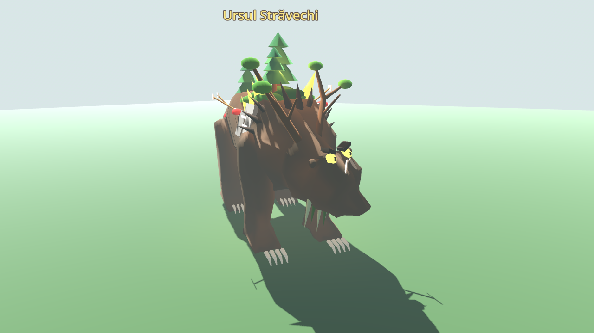
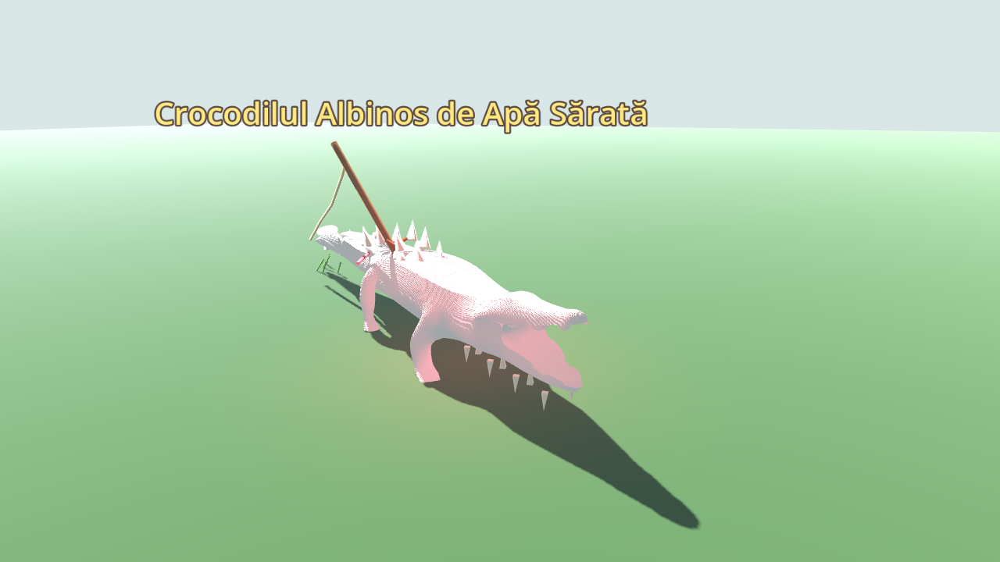
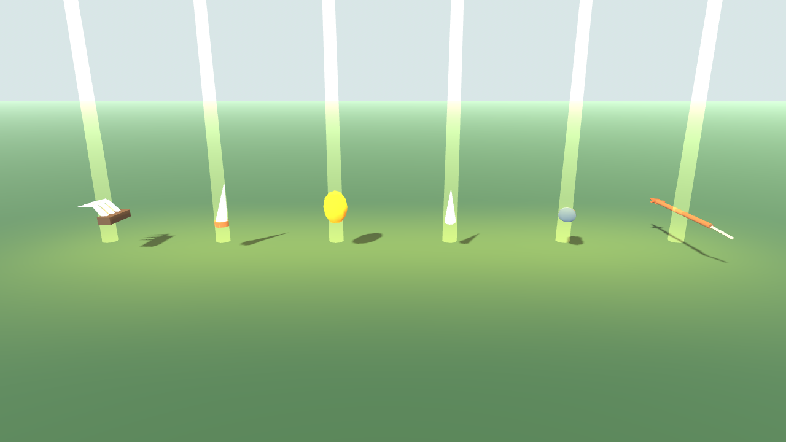

# Boșii și hărțile mari

Hărțile au acum 2,4 × 2,4 km (de patru ori suprafața de dinainte), pentru că echipa merge mult cu Stejarul Călător. Fiecare hartă are un boss, care se trezește la întâmplare departe de vânători.

## Hărțile de 2,4 km

- `ForestMap.SIZE = 2400`, `STEP = 8`, `CELLS = 300`, `LIMIT = SIZE/2 − 10` (vânători, animale și camion stau înăuntru).
- Terenul e o grilă indexată: fiecare înălțime e calculată o singură dată și folosită de cele șase triunghiuri din jur; normalele vin din vecini. Pe hărți de 4× mai mari, construcția terenului a coborât de la ~2 s la ~0,8 s (măsurat headless).
- `heights` (301 × 301) rămâne în memorie; minimapul își desenează relieful din ea.
- La margine se ridică dealuri împădurite (`rim_at`), ca lumea să se termine cu o creastă, nu cu o prăpastie.
- Mlaștina păstrează miezul umed și punctele de interes; are insule joase în mlaștina deschisă și dealuri spre margine.
- Copacii: ~23 000 în pădure, ~15 000 în mlaștină, aceeași densitate ca înainte. Coliziunile trunchiurilor se caută în găleți de 32 m (`trees_near`), nu prin toți copacii o dată pe secundă.

## Ursul Străvechi (Pădurea)

Un urs de 2,2 ori mai mare decât unul normal, cu o pădure pe spinare: mușchi, trei brazi mici, ciuperci, un cuib cu ouă și săgeți rupte de la vânători care n-au mai ajuns acasă. Din umeri ies cristale de chihlimbar, pe umeri are plăci de piatră și rune care strălucesc, pe cap o coroană de crengi ca niște coarne, ochi de chihlimbar, barbă de mușchi și gheare uriașe.

| | |
| --- | --- |
| Viață | 2 800 |
| Lovitură | 42, lovește **toți** vânătorii din raza ei |
| Viteză | 1,9 / 7,4 m/s |
| Agresivitate | 46 m, urmărire 220 m, memorie 45 s |
| Trofee | 3 × Gheară străveche (320), 2 × Colț de urs străvechi (480), Chihlimbar cu albină (900) |
| Blana | Blana Ursului Străvechi: 1 400 de bază, 8 spații |

## Crocodilul Albinos de Apă Sărată (Mlaștina)

Un crocodil de apă sărată de ~7,6 m, alb-rozaliu, cu ochi de rubin. Are spini osoși pe spate și pe coadă, scoici și alge de la mare, cicatrici și un harpon vechi înfipt în spinare, cu frânghia încă atârnând. Gura e plină de dinți strâmbi.

| | |
| --- | --- |
| Viață | 3 400 |
| Lovitură | 48, lovește toți vânătorii din raza ei |
| Viteză | 1,5 / 6,4 m/s, trăiește în apă |
| Agresivitate | 36 m, urmărire 200 m, memorie 45 s |
| Trofee | 4 × Dinte de crocodil albinos (340), 2 × Gastrolit lustruit (520), Harpon străvechi (1 000) |
| Pielea | Piele de crocodil albinos: 1 800 de bază, 9 spații |

## Reguli

- **Spawn:** la începutul expediției se trezește un boss într-un loc la întâmplare, la cel puțin 260 m de vânători și de camion. Ursul nu apare în lac; crocodilul apare doar în apă. Peste 90–150 s poate apărea al doilea. **Niciodată mai mult de doi deodată**, iar cei doi stau la cel puțin 400 m unul de altul. După ce cade unul, următorul vine după 2,5–4 minute.
- **Toată echipa e anunțată:** „Ursul Străvechi s-a trezit undeva pe hartă!” și „… a căzut!”.
- **Plimbarea:** un boss are o lesă de 70 m în jurul „casei”. Din când în când își mută casa la 150–320 m (pe uscat, sau în apă pentru crocodil), așa că se plimbă prin hartă. Boșii nu dispar când sunt departe de vânători.
- **Lupta:** lovitura unui boss lovește toți vânătorii din rază, nu doar ținta. Cine stă pe terasă e în siguranță, dar pe verandă ursul te poate ajunge.
- **Prada:** când cade, boss-ul împrăștie trofeele în cerc în jurul corpului. Fiecare are modelul lui (gheare, colț, chihlimbar cu albină, dinte, pietre lustruite, harpon), o lumină aurie și un fascicul vertical care se vede de departe. Trofeele se iau cu E, ca orice loot, și se vând la geamul de vânzare. Blana/pielea se jupoaie manual (16 tăieturi, foarte greu), de la o distanță mai mare decât la animalele mici (`AnimalHarvestInteractable.reach`).
- Boșii nu intră în tragerea normală la sorți (`spawn_weight = 0`), au `boss = true` și lista `trophies` în `.tres`.

## Fișiere

- `data/animals/ancient_bear.tres`, `data/animals/albino_crocodile.tres`; `data/loot/` (8 resurse noi).
- `data/animal_catalog.gd`: `BOSSES`, `boss_for()`, `all_animals()`, `TROPHY_IDS`.
- `actors/animals/boss_dress.gd` + `actors/animals/models/{ancient_bear,albino_crocodile}.tscn`: modelele de boss (bear.glb și crocodile.glb mărite, cu piese toon pe `BoneAttachment3D`, deci se mișcă odată cu animațiile).
- `art/animal_surface.gdshader`: parametrul `lift` decolorează blana (albinosul).
- `actors/animals/wildlife_animal.gd`: lovitura în arie, plimbarea, eticheta aurie, culorile.
- `core/network_session.gd`: `spawn_boss`, `_tick_bosses`, `living_bosses`, `boss_defeated`, `MAX_BOSSES = 2`.
- `world/pickups/loot_pickup.gd`: aspectul trofeelor.

## Verificare

`tests/verify_bosses.gd` (suita `bosses`, 76 de verificări): conținut și prețuri, harta de 2,4 km și grila ei, găleți de copaci, marginea, spawn-ul (unul la început, departe; al doilea; niciodată trei), boșii nu dispar când sunt departe, lovitura în arie, trofeele în cerc, ridicarea unui trofeu, jupuirea de la distanță, logica HUD (bara de boss, toast-uri, numere de damage, contextul), datele minimapului (relief, nordul, rotirea) și crocodilul albinos în apă, în mlaștină. `tests/preview_bosses.gd [director]` face capturile de mai sus.
