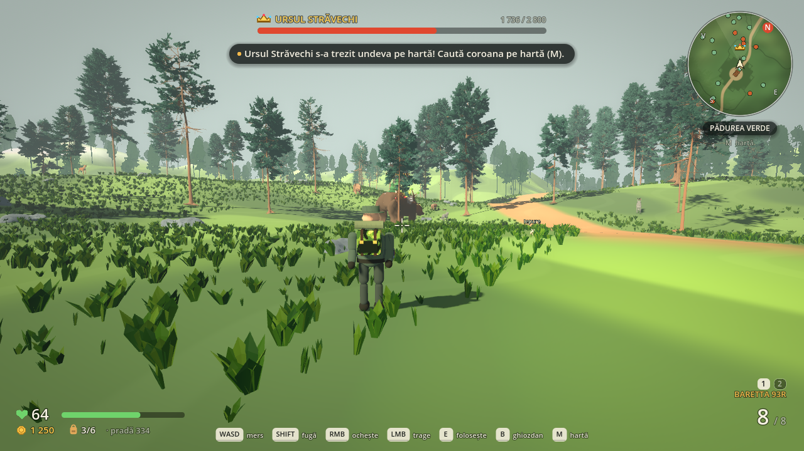
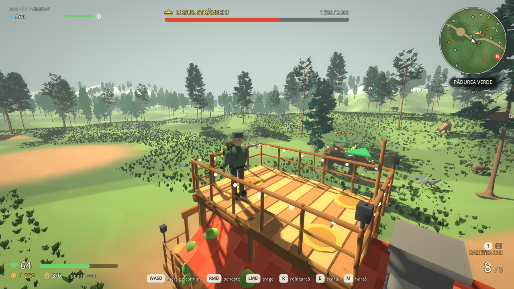
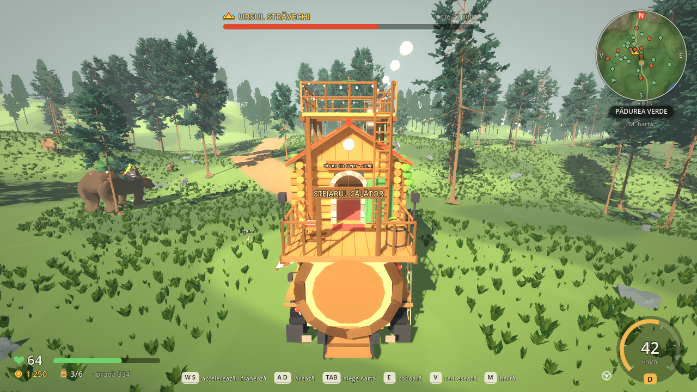
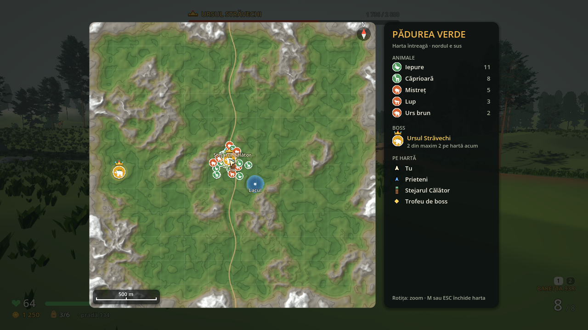
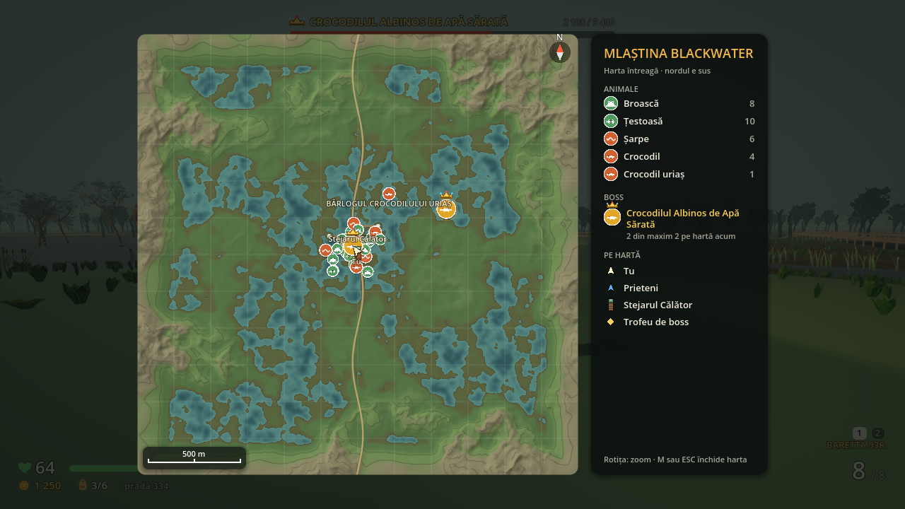

# HUD-ul și hărțile

HUD-ul e refăcut de la zero: minimal, rotunjit, fără panouri pătrate mari, cu informație care apare doar când contează. Totul e desenat în cod (`ui/hud/`), deci e clar la orice rezoluție (baza de proiectare e 1280 × 720, `stretch = canvas_items`).

## Ce e pe ecran

| Unde | Ce |
| --- | --- |
| Stânga jos | Inimă și viața (număr mare + bară subțire). Când pierzi viață, rămâne o urmă albă care se stinge încet. Sub 30% inima pulsează și marginile ecranului se înroșesc. Dedesubt: monede, ghiozdanul (ocupat/capacitate, roșu când e plin) și valoarea prăzii. |
| Dreapta jos | Pe jos: numele armei, muniția mare (galbenă când scade, roșie la gol), sloturile 1/2 și arma de rezervă. La reîncărcare apare o bară. La volan: vitezometru cu arc, km/h și treapta (P/N/D/R). |
| Sus, centru | Bara de boss (coroană, nume, viață), când un boss e la sub 150 m sau a fost lovit de curând. Sub ea, notificările ca pastile care apar și dispar (maxim 3). În tabără: indiciul pentru host sau „așteptăm hostul”. |
| Sus, stânga | Doar în multiplayer: starea rețelei și prietenii, cu bară de viață și iconiță (la volan, pe camion, doborât). |
| Centru | Ținta dinamică (se deschide când alergi sau tragi, X la lovitură) și numere de damage care urcă. Sub ea: animalul ochit (nume + bară). Mai jos: promptul ca o tastă rotunjită „E” + text; la ridicarea unui prieten, un inel de progres. |
| Jos, centru | Comenzile pentru situația curentă (pe jos, pe camion, la volan, în tabără), cu taste desenate. Dispar după 10 secunde și revin când se schimbă situația. La jupuit/curățat și când ești doborât rămâne textul de ajutor. |
| Dreapta sus | Minimapul. |

## Minimapul (radarul)

- E rotund și se rotește cu camera: în sus e mereu încotro te uiți. Litera N (în cerc roșu) și E/S/V se mișcă pe margine.
- Desenează relieful real: culori după altitudine (pajiște, deal, stâncă, zăpadă), umbră de relief din nord-vest, curbe de nivel la 10 m, apa (lacul sau mlaștina), drumul, luminișul taberei și podețele din mlaștină. Totul vine din grila de înălțimi a hărții, printr-un shader (`ui/hud/map_relief.gdshader`), nu dintr-o imagine pregătită.
- Rază 105 m pe jos; la volan se depărtează până la 240 m, după viteză.
- Pe radar: animale (portocaliu = periculos, verde = pașnic), cadavre nejupuite (x), loot și trofee (romburi aurii), prietenii (săgeți albastre), camionul și boșii (coroane, până la 650 m). Camionul și prietenii rămân lipiți de margine când sunt departe, ca să-i găsești mereu.
- Sub radar: numele hărții și distanța până la camion.
- Problema veche: săgeata jucătorului era oglindită pe orizontală (spre vest arăta spre est). Acum direcțiile sunt verificate în teste.

## Harta mare (M)

- Toată harta, cu nordul în sus, același relief, plus o grilă de 200 m, busolă și o scară care se adaptează la zoom.
- **Rotița mouse-ului face zoom** (1×, 2×, 4×, 8×). Cu zoom, harta te urmărește și se oprește la marginile lumii; nivelul apare în colțul din stânga sus.
- **Fiecare animal are pictograma lui**: o siluetă vectorială pe o insignă (verde pașnic, portocaliu periculos): iepure, căprioară, mistreț, lup, urs, broască, țestoasă, șarpe, crocodil.
- **Boșii au coroană deasupra capului** și o insignă aurie care pulsează.
- Prietenii cu nume, tu (cu un inel care pulsează), camionul, trofeele, locurile cu nume (sosirea, lacul; în mlaștină coliba, turnul, bârlogul).
- Numele nu se suprapun: se desenează peste pictograme, în ordinea tu → prieteni → camion → locuri, iar unul care ar acoperi un nume deja scris se ascunde până faci zoom. Numele lungi din legendă trec pe două rânduri sau se micșorează.
- Legenda din dreapta: speciile hărții cu numărul lor de acum, boss-ul („1 din maxim 2 pe hartă acum”) și ce înseamnă celelalte semne.
- M sau ESC o închide. Harta nu pune jocul pe pauză.

## Fișiere

- `ui/hud/hud_view.gd`: HUD-ul desenat. `game/main.gd` îi dă interactabilul apropiat (`nearby`) și animalul ochit (`target_animal`) și îi trimite notificările (`toast`) și loviturile (`hit`).
- `ui/hud/hud_paint.gd`: panouri rotunjite cu umbră (StyleBoxFlat în cache), text cu contur, taste, bare, iconițe (inimă, monedă, ghiozdan, volan, craniu).
- `ui/hud/crosshair.gd`: ținta dinamică (nodul `Crosshair` din `main.tscn` a rămas, cu acest script).
- `ui/hud/vignette.gdshader`: marginile roșii/gri.
- `ui/hud/minimap.gd`, `ui/hud/map_relief.gdshader`, `ui/hud/map_icons.gd`: radarul, harta mare și pictogramele.
- `game/main.tscn`: au fost scoase panourile vechi (Header, Stats, Vitals, InteractionPrompt, Toast, Controls, AnimalHealth, HitIndicator, ViewMode, CursorHint).
- Texte RO/EN noi: `HUD_*`, `HINT_*`, `MAP_*`, `COMPASS_*`, `MINIMAP_*`.

## Verificare

- `tests/verify_bosses.gd` verifică logica: bara de boss urmărește cel mai apropiat boss și dispare când nu e niciunul aproape, notificările, numerele de damage, contextul pentru comenzi, textura de relief din grilă, nordul și estul pe radar, rotirea radarului cu camera, săgeata jucătorului și comutarea M.
- `tests/preview_hud.gd [director] [forest|swamp]` face capturile: pe jos lângă un boss, harta mare, la volan și pe terasă în mers.
- Desenul în sine se verifică doar vizual (headless nu desenează).
