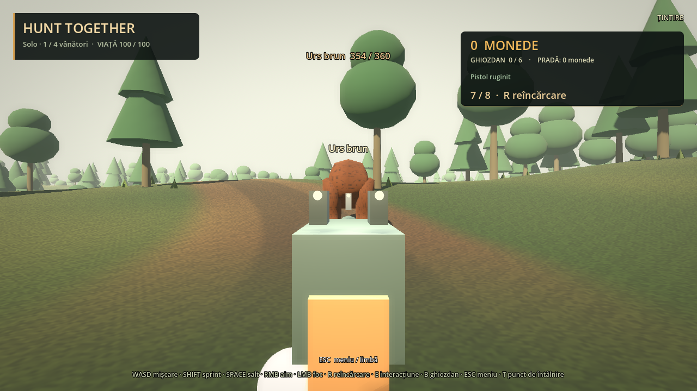
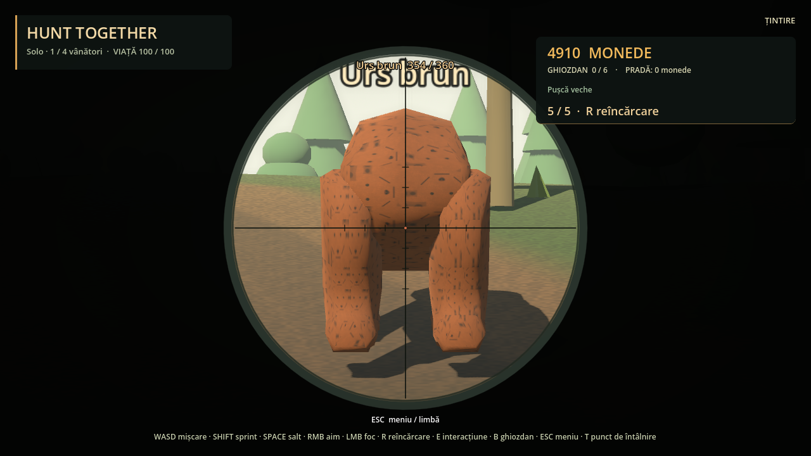
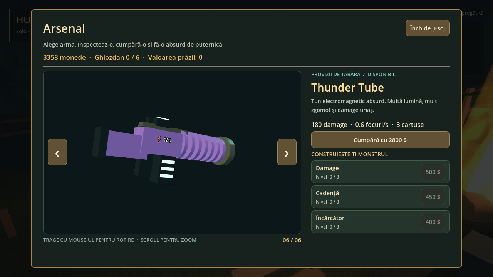

# Etapa 09 — Mlaștină disponibilă

La foc: E → Forest / Swamp → Start expedition (host). Detalii în [swamp.md](swamp.md). La întoarcere se păstrează ghiozdanele și cargo-ul cu proprietari individuali.

# Hunt Together — etapa 07

Joc 3D co-op incremental pentru PC: un host și trei prieteni, conectare directă prin IP.
Interfață English / Română, lobby nocturn cu foc uriaș, arme cu sunet,
pădure de 1,2 × 1,2 km, cinci animale animate și jeep cu patru locuri.
Magazin 3D rotativ, șase arme și upgrade-uri separate pentru damage, cadență și încărcător.
Lobby și pădure în scene separate, loading comun și jeep cu suspensie fizică pe patru roți.
First person / third person din meniu, cătare fizică și lunetă în first person.
Revive gratuit: un coechipier ține E timp de 3 secunde lângă vânătorul doborât.
Steam API se adaugă separat; proiectul nu depinde de Steam.

## Pornire și multiplayer

Deschide `open_in_godot.cmd` sau importă `project.godot` în Godot 4.7.2.
**F8 → F5** dacă versiunea veche încă rulează.

1. Hostul alege un nume și **Găzduiește / Host game**. Port implicit: **24567 UDP**.
2. Ceilalți introduc numele lor, IP-ul hostului și același port, apoi **Conectează / Join game**.
3. În aceeași rețea folosiți IP-ul local al hostului. `127.0.0.1` funcționează numai pe același PC.
4. Prin internet, conectarea directă necesită acces la portul UDP al hostului, inclusiv port forwarding în router când există NAT. Steam matchmaking / relay nu sunt implementate în această etapă.
5. Toți rămân în tabără, cu tarabele disponibile. La foc, **E** deschide meniul hărților, numai **Forest / Pădure**. Numai hostul apasă **Pornește expediția / Start expedition**: toți văd loading screen-ul cu progres real și numărul celor pregătiți. Expediția începe numai după ce fiecare jucător conectat a încărcat pădurea. Jeep-ul apare lângă grup, în poiană. Clienții văd harta cu Start dezactivat. Serverul verifică și proximitatea hostului față de foc. Un client nu poate porni expediția. Start funcționează și în solo sau cu 1–4 jucători conectați.
6. În pădure, hostul alege **Esc → Înapoi în tabără / Return to camp**. Toți revin prin loading, cu armele, banii, ghiozdanele și portbagajul păstrate. Tarabele sunt în lobby.
7. Hostul poate anula încărcarea pădurii. Dacă un jucător se deconectează în loading, echipa rămasă poate continua.
8. **Esc** deschide meniul: limbă, perspectivă, volum, efecte, ieșire din sesiune. Lumea continuă pentru ceilalți jucători.

Pentru mai multe instanțe pe același PC folosește argumente distincte după `--`:
`--profile=host`, `--profile=client1`, `--profile=client2`, `--profile=client3`.
Fiecare profil primește preferințe și identitate separate. Același profil activ nu poate ocupa două locuri.

## Controale și bucla de joc

| Control | Acțiune |
| --- | --- |
| WASD / Shift / Space | Mișcare / alergare / salt |
| Mouse / RMB | Privire / țintire în perspectiva aleasă |
| LMB | Trage; ține apăsat pentru Beehive |
| R | Reîncarcă; încărcătoare reale, rezervă nelimitată în această etapă |
| E | Foc: harta / tarabă / pradă / urcare sau coborâre din jeep |
| Ține E 3 s | Revive gratuit lângă un coechipier doborât |
| B / Esc | Ghiozdan / meniu sau închidere tarabă |
| WASD / Space în jeep | Accelerație, marșarier, direcție / frână |
| V în apropierea jeep-ului | Redresează jeep-ul răsturnat și oprit |
| T pe jos | Revine la punctul de întâlnire al hărții curente |

Pregătește echipamentul în lobby și așteaptă Start-ul hostului. **GREENWOOD / PĂDUREA VERDE** este o hartă separată, de zi; focul și tarabele rămân în lobby.
Iepurii și căprioarele fug. Mistreții, lupii și urșii urmăresc și atacă. Împușcarea lor provoacă urmărirea shooter-ului, fără fugă.
Lupii detectează de la 45 m, urșii de la 38 m; memoria urmăririi este de 30 s, până la 125 m.
Renunță la țintele doborâte sau urcate în jeep și pot alege alt vânător viu.
Numele, poziția și viața animalelor sunt sincronizate pentru toți jucătorii.
La zero viață, animalul lasă o singură pradă; **E** o pune în ghiozdan dacă ai spațiu.
Vinde la taraba de schimb și cumpără arme și ghiozdane mai mari. Începi cu pistolul ruginit și zero monede.

**Stejarul Călător** (actualizare): tabăra e acum doar focul, iar baza e camionul parcat lângă el. La geamurile trunchiului cumperi arme (Gică), ghiozdane (Tanti Rucsandra) și vinzi pradă (Nea Fane). Când camionul e parcat, urci rampa din spate în căsuță: acolo sunt depozitul personal al lui Moș Debara și mașina de curățat blănuri. La volan (E la ușa cabinei) alegi harta, iar Tab o redeschide. Din terasă (E la scara de frânghie) tragi în timp ce altcineva conduce. Detalii: [base.md](base.md).
Lada decorativă din tabără nu mai oferă loot gratuit; banii provin din vânzarea prăzii.

| Animal | Viață | Pondere la spawn | Comportament | Loot: spații / monede |
| --- | ---: | ---: | --- | ---: |
| Iepure | 18 | 48% | Fuge | 1 / 10 |
| Căprioară | 54 | 27% | Fuge | 2 / 30 |
| Mistreț | 110 | 14% | Atacă | 3 / 60 |
| Lup | 180 | 8% | Atacă | 4 / 110 |
| Urs brun | 360 | 3% | Atacă | 6 / 240 |

Procentele sunt probabilități la fiecare alegere de spawn, nu numere garantate de animale.
După Start, hostul generează 24 animale și reface populația la intervale de 8 s, până la 40 active.
Animalele prea departe de grup sunt înlocuite în apropierea exploratorilor.
Vânătorul începe cu 100 viață. La zero viață rămâne întins pe sol, cu numele și statusul de doborât.
Numai alt jucător viu, pe jos și lângă corp poate ține E timp de **3 secunde** pentru a-l ridica la **50 viață**.
Revive-ul este gratuit, fără obiect. Progresul se vede la toți; hostul acordă viața.
Eliberarea lui E, îndepărtarea, un obstacol sau input-ul de rețea expirat anulează progresul.
Damage-ul primit de cel care ajută îl resetează; poți relua ținând E. Banii și loot-ul rămân intacte.
Revenirea automată după 8 s este eliminată. T, travel și reconectarea nu ridică automat jucătorul.
În solo sau dacă toată echipa este doborâtă nu există un coechipier disponibil pentru revive.

## Perspectivă și țintire

În meniul inițial sau **Esc → Perspectivă / Perspective** alegi **Persoana I / First person**
sau **Persoana III / Third person**. Preferința este locală și salvată; nu schimbă camerele prietenilor.
Third person păstrează apropierea peste umăr cu RMB. First person arată arma și mâinile locale;
RMB aduce arma în centru, la nivelul ochiului, și reduce FOV-ul.
Pistolul și armele fără lunetă au două puncte albe în spate și un punct pe postul din față.
Ținta HUD dispare în timpul țintirii în first person; aliniezi punctele fizice ale armei.
Old rifle are lunetă: FOV 24°, cerc cu reticul și marcaje, cu lumea reală mărită în interior.
Focul, recoil-ul, sunetul, muniția și reîncărcarea funcționează în ambele perspective.
Camera jeep-ului rămâne externă. La doborâre revii temporar în third person ca să-ți vezi corpul;
după revive se aplică din nou preferința aleasă. Armele și mâinile sunt modele native de prototip.

## Magazin și progresie

La taraba de arme sau ghiozdane, **E** deschide un catalog cu un obiect 3D central.
**‹ / ›** schimbă obiectul și reiau de la capăt la marginile catalogului.
Ține apăsat **LMB și trage pe model** pentru rotire; **scroll** schimbă zoom-ul.
Modelul are lumină proprie, independentă de noaptea din tabără. Mouse-ul din magazin nu trage cu arma echipată.

| Armă | Preț | Damage de bază / foc | Interval / foc | Încărcător | Reîncărcare |
| --- | ---: | ---: | ---: | ---: | ---: |
| Rusty pistol | Gratuit | 6 | 0,65 s | 8 | 1,4 s |
| Old rifle | 90 | 12 | 1,2 s | 5 | 1,8 s |
| Double barrel | 220 | 18, în 6 alice | 1,8 s | 2 | 2,2 s |
| Scrap Blaster | 600 | 60, în 8 alice | 0,9 s | 4 | 2 s |
| Beehive | 1200 | 22 | 0,12 s; automat | 40 | 2,5 s |
| Thunder Tube | 2800 | 180 | 1,8 s | 3 | 3,2 s |

Damage-ul shotgun-urilor este împărțit și rotunjit la întreg pe fiecare alice; impactul total depinde de câte lovesc.
Cele trei arme noi au modele native distincte și sunete originale. Thunder Tube folosește o rază instantanee în acest prototip.

Fiecare armă deținută are **trei ramuri independente, niveluri 0–3**:

- **Damage:** +35% din valoarea de bază per nivel, rotunjit la întreg.
- **Cadență:** intervalul de bază împărțit la `1 + 0,2 × nivel`.
- **Încărcător:** +25% din capacitatea de bază per nivel, rotunjit în sus; minimum un cartuș.

Prețul upgrade-ului crește cu nivelul. `upgrade_price` este baza: damage ×1, cadență ×0,9, încărcător ×0,8;
costul este baza ramurii × nivelul următor. Valorile sunt provizorii și se editează în `data/weapons/*.tres`.
Cumpărarea echipează arma. Schimbarea unei arme oprește reîncărcarea începută, păstrând cartușele fiecărei arme.
Mărirea încărcătorului adaugă capacitate; îl umpli prin reîncărcare.

Hostul validează taraba, banii, arma deținută, nivelul maxim, cooldown-ul și muniția.
Inventarul cumpărat, upgrade-urile și banii revin la reconectare la **același host încă deschis**.
**Salvarea între sesiuni nu este implementată**; închiderea hostului încheie progresul acestui prototip.

## Jeep și portbagaj

Apropie-te de lateralul jeep-ului și apasă **E**. Primul loc liber este ocupat; locul 1 este șoferul.
Camera urmărește jeep-ul fără să se încline odată cu suspensia; mouse-ul permite privirea în jur.
**W** accelerează, **S** frânează înainte de marșarier, **A/D** virează, **Space** frânează.
Frânează înainte să cobori; nu poți ieși când viteza depășește 2 m/s.

Jeep-ul folosește Jolt și un `RigidBody3D`: patru suspensii, tracțiune limitată de contactul cu solul,
viraj redus la viteză mare, frână de parcare automată când șoferul lipsește și coliziuni ale caroseriei.
Masa crește cu pasagerii și prada. **V** redresează mașina răsturnată, oprită, fără să piardă portbagajul.
Viteze provizorii: maximum de referință 22 m/s înainte și 7 m/s în marșarier; terenul și încărcătura influențează accelerația.

În spatele jeep-ului, **E** deschide portbagajul de **120 spații**.
**Depune** mută ce încape din ghiozdan. **Retrage** aduce numai prada ta înapoi.
Restul rămâne în locul inițial când nu există spațiu.
Fiecare obiect păstrează proprietarul care l-a colectat, inclusiv la reconectare la același host.

Parchează jeep-ul la maximum 8 m de taraba de vânzare. Butonul **Vinde prada mea din portbagaj**
creditează numai portofelul tău și lasă intacte obiectele celorlalți.
Vânzarea ghiozdanului are un buton separat.

## Fișiere și stare

- `ui/maps/map_menu.gd`: selecția hărții de la foc.
- `actors/hunter/camera_rig.gd`, `first_person_weapon.gd`: perspective și cătare fizică.
- `world/interactables/revive_interactable.gd`: corpul doborât și promptul de revive.
- `core/network_session.gd`: comenzi validate pe host, sincronizare și limita de patru jucători.
- `world/world_router.gd`, `ui/loading/loading_screen.gd`: schimbarea hărții, progres și bariera de încărcare.
- `world/lobby/lobby.tscn`, `world/forest/forest_world.tscn`: scene independente.
- `world/forest/forest_map.gd`: teren, drum, arbori grupați în MultiMesh și coliziuni din apropiere.
- `actors/animals/wildlife_animal.gd`, `models/`: AI, skeleton, animații, etichete și viață.
- `data/animals/*.tres`: raritate, viață, viteze, agresivitate și loot editabile în Inspector.
- `actors/vehicles/hunting_jeep.gd`: condus, pasageri, cameră, faruri și coliziuni.
- `docs/architecture.md`, `steam_integration.md`: module și punctul de conectare pentru viitorul Steam peer.
- `docs/verification.md`: verificări și capturi.
- `assets/animals/forest/ATTRIBUTION.md`: autori, surse, CC0 și modificări.

Prototipul păstrează progresul la reconectare cât timp hostul rămâne deschis.
Salvarea progresului între sesiuni, migrarea hostului, matchmaking și balansarea finală sunt etape viitoare.
Fauna este texturată și animată, cu modele low-poly de test; pădurea folosește vegetație stilizată.
Testele de rețea sunt locale, cu procese separate; conexiunea între PC-uri prin internet nu a fost testată aici.

Detaliile conectării directe urmează [documentația Godot multiplayer](https://docs.godotengine.org/en/4.7/tutorials/networking/high_level_multiplayer.html).
