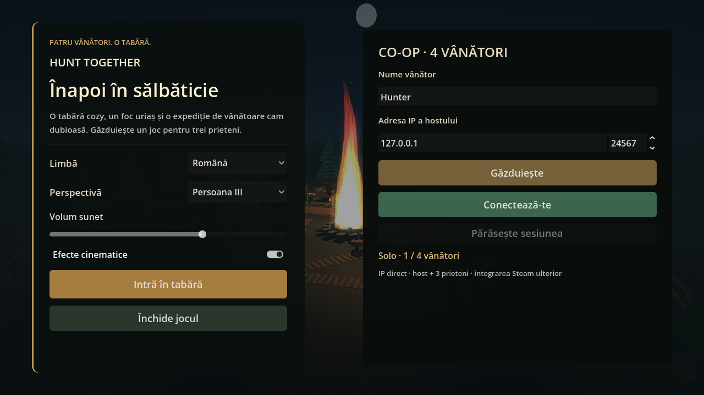
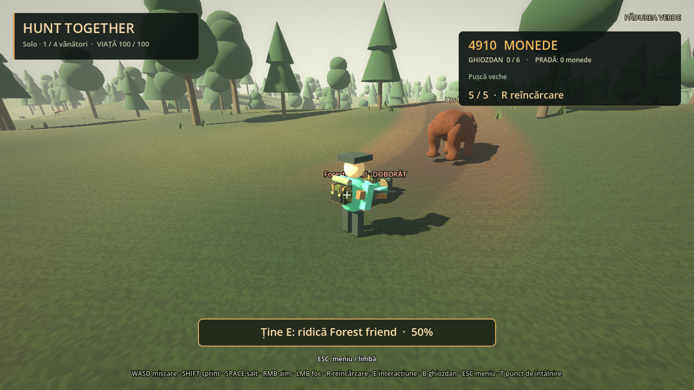
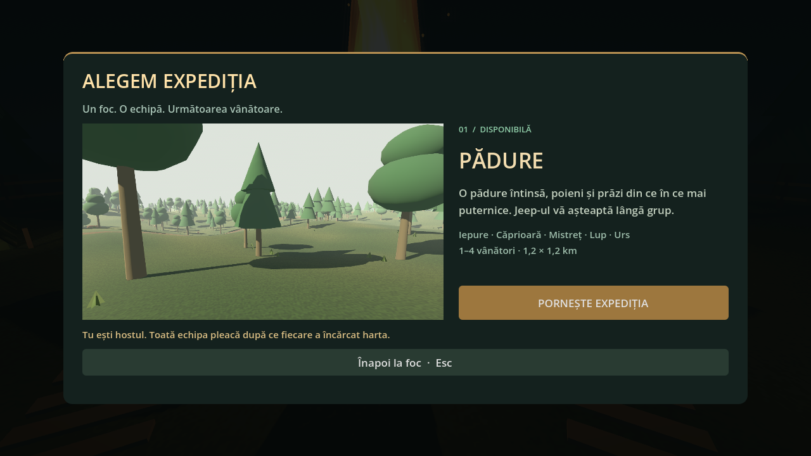

# Verificare — etapa 09, 5 octombrie 2026

512 verificări trecute, zero eșecuri: 230 regresii de gameplay, 45 artă/percepție/animație, 48 mlaștină și 189 ENet cu host + trei clienți și al cincilea respins. Testele headless finale au loguri curate, fără erorile de material nul de la prima integrare. Resursele înlocuite sunt reținute cât timp serverul de randare le poate utiliza.

Mlaștina: selecție EN/RO, autoritate host la foc, loading, hartă deterministă cu zone umede și uscate, jeep alături, cinci specii cu raritate/HP/loot crescătoare, prădători care urmăresc și mușcă, plutire pentru crocodil, mișcare încetinită în noroi, guardian păstrat în bârlog, cinci animații rigged ale crocodilului, ambient în buclă, loot în bag/cargo/vânzare individuală și trecere înapoi la Forest fără pierderea portofelului. Mers măsurat într-o fereastră de 30 cadre: 2,11 m uscat față de 1,27 m în apă/noroi.

ENet: barieră cu client întârziat, loading pe fiecare peer, fauna și HP replicate, atac asupra clientului, revive ținut de alt client, trei proprietari în portbagaj, vânzare individuală, condus remote, patru locuri, trageri FPS validate, cooldown, disconnect/reconnect și progres păstrat. Rulare reușită: run_20261005_020331_6daec0. Transport local loopback; internet WAN și Steam API nu sunt validate.

Verificare vizuală nativă: Vulkan Forward+, RTX 3050 Ti Laptop, 1280×720, setare Medium. Capturi landscape/hut/crocodile/frog/map menu salvate în docs. În captura finală apropiată a faunei: aproximativ 48 FPS, 1,95 milioane primitive și 804 draw calls. Acesta este un eșantion, nu un benchmark garantat pe întreaga hartă. Verificarea separată a rigului a eliminat deformarea capului prin folosirea animațiilor crocodilului fără modifier-ul de grazing al mamiferelor. Nu există parse/shader/runtime errors în logul vizual final.

Rapoarte: test_reports/stage09/. Executabile de test: tests/run_headless_tests.ps1 și tests/run_network_tests.ps1 (parametrul -Map swamp sau -Map forest). Surse/limite vizuale: assets/art/ATTRIBUTION.md și docs/swamp.md.

---

# Verificare — etapa 07, 4 octombrie 2026

**427 verificări trecute în rulările finale, zero eșecuri.**

| Suită | Verificări |
| --- | ---: |
| Hartă la foc și animale agresive | 42 |
| Scene, loading, jeep fizic și HP păstrat la travel | 45 |
| Pădure, animații, loot, proprietate și locuri | 56 |
| Progresie, arme, muniție și carousel | 50 |
| Revive, perspective, aliniere și setări | 37 |
| ENet host / client1 / client2 / client3 / al cincilea refuzat | 48 / 44 / 43 / 51 / 3 = 189 |
| Viewport E la foc, click Start, fără foc accidental | 3 |
| Input real: foc FPS, ADS, scope, progres și revive cu E | 5 |

Godot 4.7.2 / Windows / Jolt. Toate procesele finale au ieșit cu codul 0.
Cinci procese ENet reale pe loopback; host și trei clienți, al cincilea refuzat.
Rapoarte complete: `test_reports/stage07/`; rulare ENet `run_20261004_174446_9088cc`.

Verificat: E la foc, numai Forest, EN/RO, Esc, Start doar de la host și numai lângă foc;
animalele agresive urmăresc shooter-ul și atacă, cele pasive fug; un lup atacă un client real și toți văd hp/Attack.
Hunter-ul rămâne întins după 8 s, nu se poate ridica singur sau prin T, travel și reconnect.
Revive cere alt hunter viu, apropiere și vizibilitate; release, damage și input expirat opresc progresul.
Un client real ridică alt client la 50 hp prin input E; toți văd corpul și revenirea în picioare.
Banii și loot-ul rămân intacte. Preferința camerei se schimbă din meniu și se salvează.
Corpul altor jucători rămâne vizibil. ADS first person centrează arma și ascunde ținta HUD.
Pistolul are trei puncte fizice; front sight se proiectează la maximum 3 pixeli de centrul camerei.
Old rifle are scope și FOV 24°. Tragerea FPS reală rănește animalul și consumă muniție;
raza remote FPS funcționează pe host. E real produce procent și revive chiar peste pauza de randare a unei capturi.
Loading cu client întârziat, cancel, late join, inventare, cargo, upgrade-uri, patru locuri, condus de client,
suspensie, viraj, frână, reverse, pantă, impact și redresare rămân verificate.

## Reproducere

```powershell
godot --headless --max-fps 60 --path . --script res://tests/verify_maps_predators.gd
godot --headless --max-fps 60 --path . --script res://tests/verify_worlds_vehicle.gd
godot --headless --max-fps 60 --path . --script res://tests/verify_forest.gd
godot --headless --max-fps 60 --path . --script res://tests/verify_progression.gd
godot --headless --max-fps 60 --path . --script res://tests/verify_revive_perspective.gd
./tests/run_network_tests.ps1 -GodotExecutable 'C:/cale/catre/Godot.exe'
godot --max-fps 60 --path . --script res://tests/verify_visual.gd
godot --max-fps 60 --path . --script res://tests/verify_maps_visual.gd
```

Suitele grafice necesită fereastra Godot și regenerează capturile docs; fără --headless.
Nu rula două suite ENet simultan: portul de test este 24680.

RTX 3050 Ti / Compatibility / OpenGL 3.3 / 1280 × 720; meniul și scenele inspectate vizual.
Mediul restricționat emite mesajul shader cache user://; randarea și testele grafice funcționează.
Rulările finale de gameplay/rețea nu au emis erori de script sau de rețea.
Modelele sunt de prototip; cătarea pistolului este geometrie fizică. Evitarea copacilor este locală, fără navmesh global.
WAN, Steam, latență mare, salvare pe disc și migrarea hostului nu sunt validate aici.






